PAV - P5: síntesis musical polifónica
=====================================

Obtenga su copia del repositorio de la práctica accediendo a [Práctica 5](https://github.com/albino-pav/P5) 
y pulsando sobre el botón `Fork` situado en la esquina superior derecha. A continuación, siga las
instrucciones de la [Práctica 2](https://github.com/albino-pav/P2) para crear una rama con el apellido de
los integrantes del grupo de prácticas, dar de alta al resto de integrantes como colaboradores del proyecto
y crear la copias locales del repositorio.

Como entrega deberá realizar un *pull request* con el contenido de su copia del repositorio. Recuerde que
los ficheros entregados deberán estar en condiciones de ser ejecutados con sólo ejecutar:

~~~~~~~~~~~~~~~~~~~~~~~~~~~~~~~~~~~~~~~~~~~~~~~~~~~~~.sh
  make release
~~~~~~~~~~~~~~~~~~~~~~~~~~~~~~~~~~~~~~~~~~~~~~~~~~~~~

A modo de memoria de la práctica, complete, en este mismo documento y usando el formato *markdown*, los
ejercicios indicados.

Ejercicios.
-----------

### Envolvente ADSR.

Tomando como modelo un instrumento sencillo (puede usar el InstrumentDumb), genere cuatro instrumentos que
permitan visualizar el funcionamiento de la curva ADSR.

  Con tal de observar la curva ADSR hemos generado 4 instrumentos con diferentes ADSR, tomando como modelo el instrumento seno
  (que hay que realizar posteriormente):

* Un instrumento con una envolvente ADSR genérica, para el que se aprecie con claridad cada uno de sus
  parámetros: ataque (A), caída (D), mantenimiento (S) y liberación (R).
  
  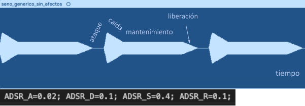
  
  Hemos generado el fichero .wav con el programa synth y la curva ADSR deseada, la visualizamos en un editor de audio y vemos
  que en su representación temporal se observa de maravilla la curva ADSR, observando como la amplitud de la nota no se
  mantiene constante a lo largo del tiempo sino que pasa por diferentes fases de intensidad. Observamos un ataque rápido, una
  caída moderada, un largo mantenimiento y una liberación normal.
  
* Un instrumento *percusivo*, como una guitarra o un piano, en el que el sonido tenga un ataque rápido, no
  haya mantenimiemto y el sonido se apague lentamente.
  - Para un instrumento de este tipo, tenemos dos situaciones posibles:
    * El intérprete mantiene la nota *pulsada* hasta su completa extinción.
    
    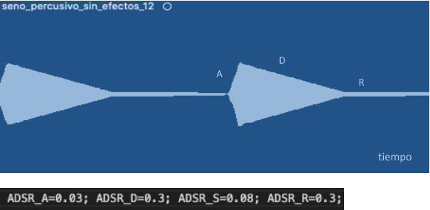
    
    Observamos que como el ataque es rápido, la caída es lenta, ya que la nota se va apagando lentamente, no tiene
    mantenimiento y la libración también es muy lenta, pues sería como si dejásemos la cuerda pulsada y así solo se liberaría
    realmente al empezar la siguiente nota y levantar la presión de esta anterior.
    
    * El intérprete da por finalizada la nota antes de su completa extinción, iniciándose una disminución
	  abrupta del sonido hasta su finalización.
    
    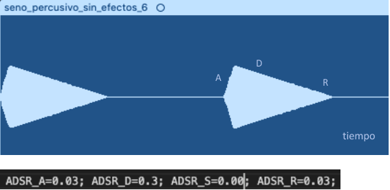
    
    Observamos que en el ataque rápido la caída es lenta, porque la nota se va apagando lentamente y de repente soltamos,
    dejando muy poco tiempo de liberación. Se observa como la nota se acaba rápidamente, sin llegar ni de lejos a la
    siguiente.
	  
  - Debera representar en esta memoria **ambos** posibles finales de la nota.
  
* Un instrumento *plano*, como los de cuerdas frotadas (violines y semejantes) o algunos de viento. En
  ellos, el ataque es relativamente rápido hasta alcanzar el nivel de mantenimiento (sin sobrecarga), y la
  liberación también es bastante rápida.
  
    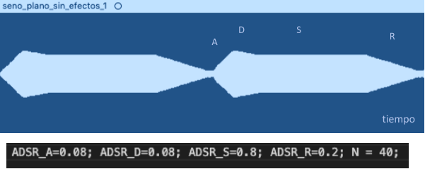
  
    Si observamos, vemos como la curva ADSR se cumple a la perfección con lo estipulado, el ataque relativamente rápido, la
    caída más o menos rápida, un mantenimiento muy largo y una liberación lenta. Esto lo hicimos porque nos parecía más
    verosímil como el sonido de un violín en el que las notas se solapan, es decir, una no se apaga hasta que no empieza la
    siguiente.
  
Para los cuatro casos, deberá incluir una gráfica en la que se visualice claramente la curva ADSR. Deberá
añadir la información necesaria para su correcta interpretación, aunque esa información puede reducirse a
colocar etiquetas y títulos adecuados en la propia gráfica (se valorará positivamente esta alternativa).

### Instrumentos Dumb y Seno.

Implemente el instrumento `Seno` tomando como modelo el `InstrumentDumb`. La señal **deberá** formarse
mediante búsqueda de los valores en una tabla.

- Incluya, a continuación, el código del fichero `seno.cpp` con los métodos de la clase Seno.
    
    ```c
    #include <iostream>
    #include <math.h>
    #include "seno.h"
    #include "keyvalue.h"

    #include <stdlib.h>

    using namespace upc;
    using namespace std;

    //El modo sencillo de generar un sonido periodico de frecuencia
    //variable es almacenar un periodo del mismo en una tabala y 
    //recorrer esta a una velocidad adecuada para conseguir
    //el pitch deseado

    //Constructor
    seno::seno(const std::string &param) 
      : adsr(SamplingRate, param) {
      bActive = false;
      x.resize(BSIZE);

      /*
        You can use the class keyvalue to parse "param" and configure your instrument.
        Take a Look at keyvalue.h    
      */

      //Usando funciones de la libreria keyvalue.h analizamos
     //la cadena de parámetros de interes para el instrumento, en este caso
     //solamente la longitud de la tabla N, ya que los parametros ADSR se procesan 
     //en otra parte
      KeyValue kv(param);
      int N;

      if (!kv.to_int("N",N))
        N = 40; //default value
  
      //Se crea la tabla con un periodo de sinusoide
      tbl.resize(N);
      float phase = 0, step = 2 * M_PI /(float) N;
      index = 0;
      for (int i=0; i < N ; ++i) {
        tbl[i] = sin(phase);
        phase += step;
      }
    }

  //Cada vez que el programa encuentra un comando MIDI en el fichero score, invoca al
  //método command(comando, la nota, la velocidad)
  //si el comando es 9 (NoteOn) se declara activo el instrumento
  //inicializa curva ADSR y un contador index que recorre la tabla,
  //de amplitud A. Si cmd = 8 o 0 (NoteOff o EndNote) el metoo inicia la fase release de la curva
  //o fiinaliza el sonido, respectivament
  void seno::command(long cmd, long note, long vel) {
    //NoteOn instrumento Activo
    if (cmd == 9) {		//'Key' pressed: attack begins
      bActive = true;
      adsr.start();
      index = 0;
      A = vel / 127.;
      //Sabiendo la correspondencia de La central definimos F0 para otras notas y definimos los saltos
      float F0 = 440.00 * pow(2, (note - 69.00)/12.00) / SamplingRate;
      step = tbl.size() * F0;
    }
    //Fase release de la curva
    else if (cmd == 8) {	//'Key' released: sustain ends, release begins
      adsr.stop();
    }
    //Finaliza el sonido
    else if (cmd == 0) {	//Sound extinguished without waiting for release to end
      adsr.end();
    }
  }

  //La sintesis se realiza aquí
  //La nota puede encontrarse en 3 situaciones Finalizada, Inactiva, Activa:
  const vector<float> & seno::synthesize() {
    //Finalizada: si la curva ha llegado a su nivel final
    if (not adsr.active()) {
      x.assign(x.size(), 0);
      bActive = false;
      return x;
    }
    //Inactiva si ya ha sido marcada como inactiva
    else if (not bActive)
      return x;
    //Activa, se aplica la envolvente ADSR, aquí es donde se recorre la tabla
    for (unsigned int i=0; i<x.size(); ++i) {
      // Primera aproximación: redondeando el indice requerido para acceder a valores de la tabla
      float new_index = round(index * step);
      x[i] = A * (tbl[new_index]);
      index += 1;
      if (new_index == tbl.size()) index = 0;
    }
    adsr(x); //apply envelope to x and update internal status of ADSR

    return x;
  }
   ```
    
- Explique qué método se ha seguido para asignar un valor a la señal a partir de los contenidos en la tabla,
  e incluya una gráfica en la que se vean claramente (use pelotitas en lugar de líneas) los valores de la
  tabla y los de la señal generada.
    
    El instrumento seno funciona de la siguiente manera: se coge un periodo de la señal sinusoidal y se guarda en la tabla con
    N muestras, a continuación ese periodo registrado en la tabla se puede recorrer más rápido o más lento, y eso es lo que
    haremos para generar notas más agudas, o más graves respectivamente.
    
    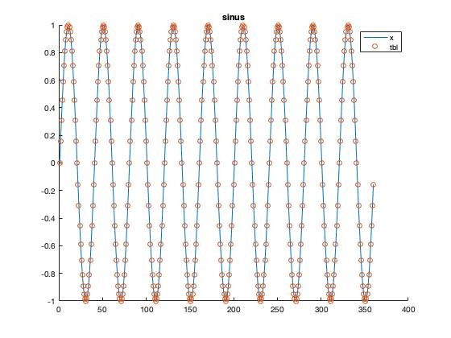
    
- Si ha implementado la síntesis por tabla almacenada en fichero externo, incluya a continuación el código
  del método `command()`.

### Efectos sonoros.

- Incluya dos gráficas en las que se vean, claramente, el efecto del trémolo y el vibrato sobre una señal
  sinusoidal. Deberá explicar detalladamente cómo se manifiestan los parámetros del efecto (frecuencia e
  índice de modulación) en la señal generada (se valorará que la explicación esté contenida en las propias
  gráficas, sin necesidad de *literatura*).
    
    ***Tremoto***
    
    Hemos generado dos gráficas de Tremolo, una con una profundidad de modulación muy grande, por tanto, habrá variaciones muy
    grandes en el volumen del sonido y su amplitud y por el contrario una frecuencia de modulación pequeña, es decir que habrá
    cambios cada más tiempo, no son muy seguidos los cambios.
    
    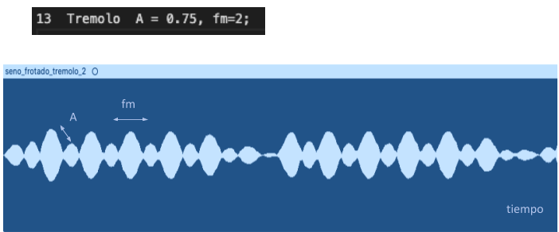
    
    En el segundo caso que se muestra a continuación, las variaciones serán más verosímiles y así la amplitud de la sinusoide
    no se verá tan afectada:
    
    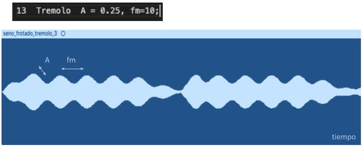
    
    ***Vibrato***
    
    En cuanto al vibrato, sabemos que varía la frecuencia fundamental de la nota en función de los parámetros Intensidad
    y la frecuencia de modulación. En la siguiente imagen podemos observar como las dos empiezan a la vez, pero no oscilan a
    la misma frecuencia ya que el vibrato la va cambiando:
    
    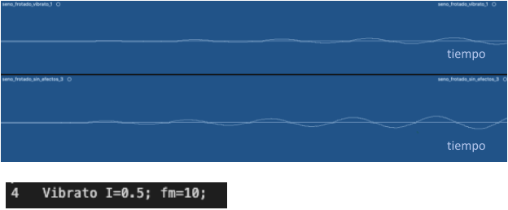
    
    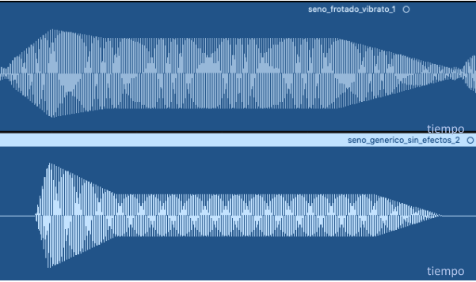
    
    En esta segunda imagen podemos ver como mientras en la segunda gráfica la frecuencia se mantiene constante, arriba la
    frecuencia va variando, comprimiendo y estirando la frecuencia fundamental de una misma nota. Este efecto puede ser
    agradable en ciertos estilos de música e instrumentos, siempre y cuando no nos pasemos cambiando la frecuencia. En el
    ejemplo de la guitarra o el bajo, queda muy bien en ciertos momentos mover el dedo un poco por la cuerda, para cambiar la
    tensión producida y generar vibrato, pero si nos vamos 2 trastes abajo, queda mal, pues ya es claramente otra nota.
    Incluso, muchas guitarras llevan un puente flotante o semiflotante para producir efecto de vibrato, que queda muy bien si
    se sabe balancear el puente correctamente, cambiando la tensión de las cuerdas y por tanto su afinación en diversos
    estilos y canciones.
    
- Si ha generado algún efecto por su cuenta, explique en qué consiste, cómo lo ha implementado y qué
  resultado ha producido. Incluya, en el directorio `work/ejemplos`, los ficheros necesarios para apreciar
  el efecto, e indique, a continuación, la orden necesaria para generar los ficheros de audio usando el
  programa `synth`.
    
    En nuestro caso, siguiendo ciertos conocimientos que teníamos de música y pedales, sabemos que la distorsión de la señal
    (algo muy deseado en estilos como el rock, en ciertos instrumentos como la guitarra) se produce haciendo saturar la señal
    que sale del instrumento. Es decir, elevando la tensión de la señal que sale de esta y recortando la señal por arriba,
    como si el amplificador no pudiese sacar toda su amplitud. Cuando la distorsión empezó a usarse, esto se producía
    realmente saturando los amplificadores de válvulas (eran los únicos que había en la época) haciéndoles entrar grandes 
    cantidades de amplitud y haciendo que estos saturaran (recortasen la señal). Ahora, usamos gran cantidad de pedales para
    ello (la mayoría analógicos) pues siguen produciendo aquel sonido tan característico de algunos amplificadores y porque
    los efectos digitales siguen siendo (a opinión de muchos) aun un poco fríos (también amplificadores).
    
    Basándonos en esto, nosotros hemos generado un filtro de distorsión muy sencillo, cogiendo como modelo el filtro de
    tremolo. Como es un filtro básico, tan solo hemos cogido un parámetro (A_MAX) la amplitud de la señal a la cual va a
    empezar a saturar, cuanto más pequeña más distorsión, pues empieza a distorsionar antes la señal. De hecho, este recorte,
    genera harmónicos superiores a múltiples de la frecuencia fundamental, con eso generamos la distorsión, cuantos más
    harmónicos más distorsión, cuanto antes recortemos la señal, más distorsión.
    
    Nuestro algoritmo sencillo, primero, eleva x4 la amplitud de la señal original y luego, recorta la señal a partir de
    cierta amplitud.
    
    ```c
    #include <iostream>
    #include <math.h>
    #include "distor.h"
    #include "keyvalue.h"

    #include <stdlib.h>

    using namespace upc;
    using namespace std;

    static float SamplingRate = 44100;

    distor::distor(const std::string &param) {
      fase = 0;

      KeyValue kv(param);

      if (!kv.to_float("A_MAX", A_MAX))
        A_MAX = 0.5; //default value

      if (!kv.to_float("fm", fm))
        fm = 10; //default value

      inc_fase = 2 * M_PI * fm / SamplingRate;
    }

    void distor::command(unsigned int comm) {
      if (comm == 1) fase = 0;
    }

    void distor::operator()(std::vector<float> &x){
      for (unsigned int i = 0; i < x.size(); i++) {
        x[i] = 2*x[i];
        if (x[i] > A_MAX){
           x[i] = A_MAX;
        } else if (x[i] < -A_MAX){
            x[i] = -A_MAX;
        }
      }
    }
    ```
    
    Para llamar a este efecto, le asignamos un numero de efecto como a tremolo o vibrato y lo construimos en el fichero
    effects.orc.
    
    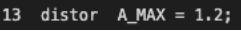
    
    Luego modificamos el fichero doremi como lo hacíamos con tremolo y vibrato. En este caso le hemos asignado el numero 13,
    el mismo que tremolo, así que lo aplicaríamos igual.
    
    Observando los resultados vemos que hemos obtenido el efecto deseado.
    
    **1. Una distorsión suave**: Apreciamos como la señal mantiene su forma casi todo el rato, pero cuando pasa un nivel
    bastante considerable ya no tiene la forma redondeada del seno si no que satura, generando una distorsión muy suave pues
    satura en puntos muy concretos.
    
    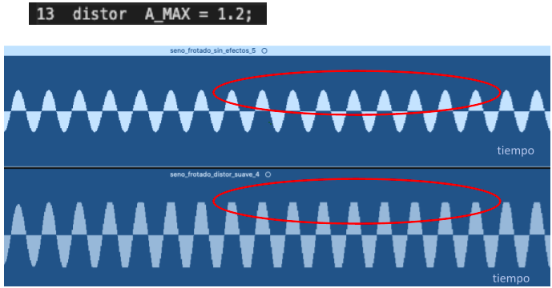
    
    **2. Distorsión heavy**: Si ponemos una A_MAX pequeña, conseguiremos que la señal quede muy distorsionada, y que haya
    perdido casi por completo su forma sinusoidal. Uno de los efectos secundarios de la distorsión elevada es una pérdida de
    la dinámica que genera el músico al tocar un instrumento: a causa de esta saturación grande, la nota prácticamente siempre
    que se toca algo fuerte satura y se aplica un efecto de compresión, en el que tocar fuerte y normal prácticamente suena
    parecido, solo se notaria la diferencia si tocas muy flojo, cuando la señal no satura. En la imagen se observa como
    incluso amplitudes pequeñas estás saturadas.
    
    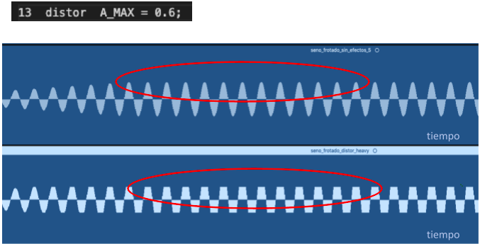

### Síntesis FM.

Construya un instrumento de síntesis FM, según las explicaciones contenidas en el enunciado y el artículo
de [John M. Chowning](https://ccrma.stanford.edu/sites/default/files/user/jc/fm_synthesispaper-2.pdf). El
instrumento usará como parámetros **básicos** los números `N1` y `N2`, y el índice de modulación `I`, que
deberá venir expresado en semitonos.

- Use el instrumento para generar un vibrato de *parámetros razonables* e incluya una gráfica en la que se
  vea, claramente, la correspondencia entre los valores `N1`, `N2` e `I` con la señal obtenida.
  
    Mediante las explicaciones incluidas en la practica y el articulo de John M Chowning y basándonos en el instrumento seno,
    producimos un instrumento que llamamos seno_vibrato que relamente se corresponde al instrumento producido mediante
    Sintesis FM.
    
    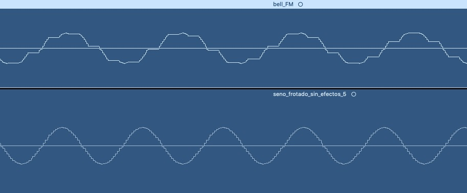
  
- Use el instrumento para generar un sonido tipo clarinete y otro tipo campana. Tome los parámetros del
  sonido (N1, N2 e I) y de la envolvente ADSR del citado artículo. Con estos sonidos, genere sendas escalas
  diatónicas (fichero `doremi.sco`) y ponga el resultado en los ficheros `work/doremi/clarinete.wav` y
  `work/doremi/campana.work`.
  * También puede colgar en el directorio work/doremi otras escalas usando sonidos *interesantes*. Por
    ejemplo, violines, pianos, percusiones, espadas láser de la
	[Guerra de las Galaxias](https://www.starwars.com/), etc.
    
    Basándonos en el articulo de John M Chowning y en nuestro código, hemos buscado la relación entre N1/N2 y la envolvente
    ADSR para cada uno de los instrumentos que se nos pide (campana y clarinete).
    
    ***Clarinete***
    
    Aquí vemos según el articulo, la envolvente ADSR del instrumento Clarinete. Según esto, definimos nuestros parámetros.
    También, según el artículo la relación N1/N2 tiene que ser 3/1 y así lo dejamos.
    
    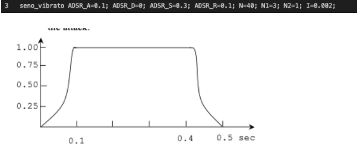
    
    ***Bell***
    
    En la siguiente gráfica, observamos la envolvente ADSR de una campana. También observamos la relación N1/N2 tiene que ser
    1/1.4, esta si la seguimos, porque a demás al no ser entero, generamos una relación inarmónica como la de las campanas.
    
    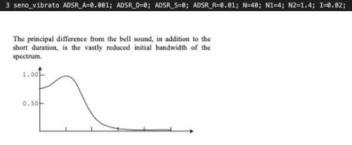

### Orquestación usando el programa synth.

Use el programa `synth` para generar canciones a partir de su partitura MIDI. Como mínimo, deberá incluir la
*orquestación* de la canción *You've got a friend in me* (fichero `ToyStory_A_Friend_in_me.sco`) del genial
[Randy Newman](https://open.spotify.com/artist/3HQyFCFFfJO3KKBlUfZsyW/about).

- En este triste arreglo, la pista 1 corresponde al instrumento solista (puede ser un piano, flautas,
  violines, etc.), y la 2 al bajo (bajo eléctrico, contrabajo, tuba, etc.).
- Coloque el resultado, junto con los ficheros necesarios para generarlo, en el directorio `work/music`.
- Indique, a continuación, la orden necesaria para generar la señal (suponiendo que todos los archivos
  necesarios están en directorio indicado).

También puede orquestar otros temas más complejos, como la banda sonora de *Hawaii5-0* o el villacinco de
John Lennon *Happy Xmas (War Is Over)* (fichero `The_Christmas_Song_Lennon.sco`), o cualquier otra canción
de su agrado o composición. Se valorará la riqueza instrumental, su modelado y el resultado final.
- Coloque los ficheros generados, junto a sus ficheros `score`, `instruments` y `efffects`, en el directorio
  `work/music`.
- Indique, a continuación, la orden necesaria para generar cada una de las señales usando los distintos
  ficheros.

Usando el programa synth, generamos la canción de Toy Story asignando los instrumentos que se nos piden. He hecho 3 versiones, todas ellas con el mismo instrumento grave:
La primera tiene al clarinete hecho con síntesis FM como solista
-	 La segunda tiene un instrumento percutido como solista
-	 La tercera es para olvidar, la campana de solista, supongo que es porque al generar inarmónicos no está en el tono del otro instrumento.

Los comandos que utilizamos son los siguientes:
- work % synth toy_story_clarinete.orc ToyStory_A_Friend_in_me.sco toy_story_percutido.wav
-	work % synth toy_story_clarinete.orc ToyStory_A_Friend_in_me.sco toy_story_clarinete.wav